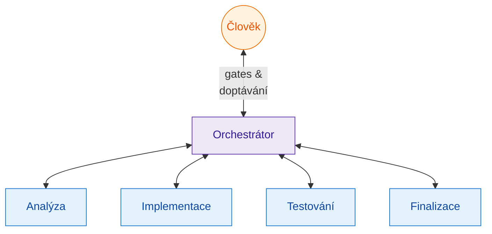
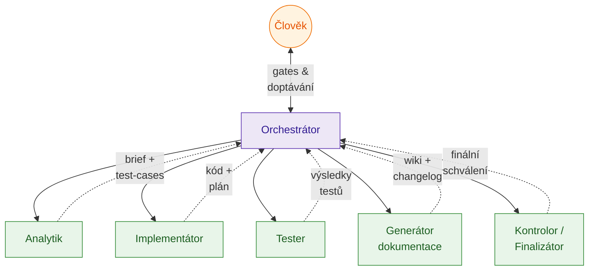
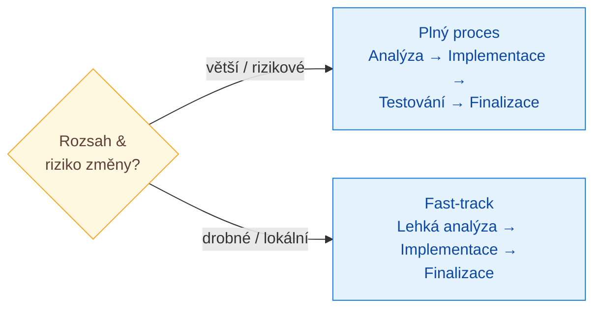

# AI-driven changes — Manifest

Manifest pro řízení změn v softwaru s pomocí AI. **Cílem není autonomní AI**, která bez dozoru mění systém, ale **řízené workflow**, kde AI dělá specializovanou práci, orchestrátor hlídá tok a člověk rozhoduje v klíčových bodech.

Tento dokument je úmyslně stručný a technologicky nezávislý. Popisuje **principy a role**. Implementovat ho lze mnoha způsoby (AI agenti, LangGraph, vlastní orchestrátor, ručně podle checklistů, …).

---

## Hodnoty

Manifest staví na pěti hodnotách. Pravá strana má svoji váhu, ale my preferujeme levou.

1. **Specializaci** nad univerzálností — každá role má svůj úkol, svůj model a svoji teplotu.
2. **Řízený tok** nad autonomií — orchestrátor je dispečer, nikoli rozhodovatel.
3. **Člověka v rozhodovacích bodech** nad rychlostí pipeline — gates se zkracují, ne škrtají.
4. **Aktuální dokumentaci** nad implicitní znalostí — wiki je vstup i výstup procesu.
5. **Logovatelnost** nad neviditelnou produktivitou — každý krok agenta i člověka je zaznamenatelný.

---

## Hlavní myšlenka

Každá změna prochází čtyřmi fázemi:

1. Analýza
2. Implementace
3. Testování
4. Finalizace

Fáze **nejsou lineární kroky**. Jsou to cíle. Mezi nimi se práce vrací, přeskakuje a přehazuje podle stavu — **tok hlídá orchestrátor**. Po klíčových bodech vstupuje **člověk**.

Manifest definuje **principy a role**, nikoli konkrétní implementaci. Specifika jednotlivých technologií, typů aplikací a edge cases (incident response, rollback, regulace, mobilní/embedded/ML cykly) budou rozpracovány v navazujících dokumentech.

---

## Předpoklad: kvalitní technická dokumentace

Manifest stojí a padá s tím, jak rychle a levně dokáže AI (i člověk) získat přesný kontext o systému. Bez něj analytik tápe, implementátor hádá a kontrolor nemá s čím porovnávat. Doporučené minimum:

- **Technická wiki** například ve stylu „LLM wiki" — strukturovaný popis kódu, architektury, přístupů, konceptů a entit, optimalizovaný pro čtení LLM i člověkem. Inspirace: [Karpathy — LLM wiki](https://gist.github.com/karpathy/442a6bf555914893e9891c11519de94f).
- **Log všech změn** — přístupná historie toho, co se v systému měnilo, proč a kdy (changelog, commit log s kontextem, archiv briefů a plánů). Umožňuje rychle dohledat, jak se k aktuálnímu stavu došlo, bez nutnosti znovu analyzovat celý kód.
- **Aktualizace ve finalizaci** — wiki i log se aktualizují **až ve finalizační fázi** rolí Generátora dokumentace. Implementační ↔ testovací smyčka může proběhnout vícekrát; regenerovat dokumentaci po každém průchodu by bylo drahé a stejně by hned zastarala. Finalizační krok se ale **nesmí přeskakovat** — zastaralá wiki je horší než žádná.

Čím přesnější a aktuálnější dokumentace, tím kratší analýza, méně doptávání člověka a méně chyb v implementaci.

---

## Role

V systému je pět pracovních rolí plus orchestrátor. Mohou to být AI agenti, lidé, nebo libovolná kombinace. **Každá role může mít vlastní model a vlastní teplotu** podle povahy úkolu — manifest neurčuje konkrétní hodnoty, ale očekává vědomou volbu.

Orchestrátor je dispečer — drží stav, rozesílá práci, hlídá gates. **Nikdy sám neschvaluje, to dělá výhradně člověk.**

### Orchestrátor

Řídí celý tok. Drží stav změny, rozhoduje, kdo je na řadě, hlídá human gates, **vrací nebo přehazuje práci mezi libovolnými fázemi** (test → implementace, kontrola → analýza, finalizace → kamkoliv) podle toho, co výstup ukáže. Nikdy sám neschvaluje.

### Analytik

Pochopí problém ze všech dostupných zdrojů a převede ho na testovatelné zadání.

- prochází wiki, dokumentaci, zdrojový kód a další kontext aplikace,
- pokud je to potřeba, proklikává si aplikaci,
- ptá se člověka, když si není jistý (a to průběžně, ne jen na konci),
- velký nebo nejasný problém **rozdělí na menší části**,
- navrhuje testovací scénáře, podle kterých bude později testovat tester.

Výstup: analytický dokument (`brief.md`) a sada testovacích scénářů (`test-cases.md`).

### Implementátor

Z analyticky připraveného zadání udělá plán a provede implementaci.

- plán je vhodné nechat odsouhlasit (zvlášť u větších změn),
- samotnou implementaci může dělat AI agent i člověk; analytik a tester pak fungují jako podpora.

### Tester

Z testovacích scénářů připraví **automatizované testy** (např. Playwright, Cypress, jiný testovací framework) a spustí je.

- pokud test odhalí chybu v aplikaci, vrací úkol přes orchestrátora zpět implementátorovi (případně analytikovi, pokud je vada v zadání),
- pokud automatizace selže (nelze rozumně napsat), explicitně to říká a předává zpět implementátorovi nebo na ruční ověření.

### Generátor dokumentace

Udržuje technickou wiki a log změn aktuální. Aktivuje se primárně ve **finalizační fázi**, kdy je kód stabilní.

- regeneruje nebo aktualizuje části wiki dotčené změnou,
- doplní záznam do logu změn (co se měnilo a proč, s odkazem na brief, plán, testy),
- nepíše dokumentaci „dopředu" pro nestabilní stav — to by produkovalo jen šum.

Výstup: aktualizovaná wiki a changelog.

### Kontrolor / Finalizátor

Závěrečná role před uzavřením změny.

- zkontroluje, jestli jsou všechny artefakty v souladu (brief, plán, kód, testy, dokumentace),
- ověří, že **původní záměr změny byl naplněn**,
- u změn bez automatických testů aplikaci proklikne ručně,
- ověří, že Generátor dokumentace odvedl práci a wiki odpovídá kódu.

---

## Konfigurace rolí: model a teplota

Manifest žádný konkrétní model nepředepisuje, ale očekává **vědomou volbu** pro každou roli. Příklad jedné rozumné konfigurace:

- **Analytik** — silný model, vyšší teplota; hledá souvislosti a alternativy.
- **Implementátor** — silný model, nižší teplota; deterministický výstup.
- **Tester** — model s důrazem na detail, nízká teplota; stabilita.
- **Generátor dokumentace** — model s dobrou strukturou textu, střední teplota.
- **Kontrolor** — silný model, nízká teplota; konzistentní úsudek.

Konkrétní volba se ladí podle projektu, ne jednou pro všechny. Klíčový princip: **role není = model**. Jedno fyzické zadání (LLM) může obsluhovat víc rolí, jedna role může používat různé modely podle úkolu.

---

## Human gates

Člověk vstupuje do toku v těchto bodech:

1. **V průběhu analýzy** — analytik se doptává, když si není jistý.
2. **Po analýze** — schválení briefu a testovacích scénářů.
3. **Po plánu implementace** — schválení plánu (u větších změn).
4. **Po testování / finalizaci** — finální schválení změny.

Human gates se nepřeskakují. Mění se jen jejich hloubka podle velikosti změny.

---

## Logovatelnost

Manifest předpokládá, že **každý krok je zaznamenatelný a auditovatelný**:

- **kdo** úkol vykonal (člověk nebo agent, kterým modelem a s jakou teplotou),
- **kdy** byl artefakt vytvořen a kdy schválen, kým a s jakým komentářem,
- **jakou cestou** prošla změna — které návraty a přehazování mezi fázemi se staly.

Logovatelnost není volitelný doplněk. Bez ní nelze manifest zlepšovat (chybí data), nelze ho obhájit v regulovaném prostředí a nelze diagnostikovat, kde proces selhal.

---

## Vědomé riziko AI

Manifest přiznává a počítá s tím, že AI agent může:

- **halucinovat** kontext, kód, testy nebo dokumentaci,
- **selhat nedeterministicky** — stejný vstup dá různé výstupy,
- **vložit chybu nebo nezamýšlené chování**, které ostatní agenti (např. tester) nemají důvod hledat.

Proto jsou **člověk u gates** a **kontrolor** poslední pojistkou. Důvěra ve výstup AI se buduje měřením a logováním, ne přijetím na slepo.

---

## Fast-track pro drobné změny

Plný proces nesmí brzdit prkotiny. U **drobných a jednoduchých změn** (překlep, malá UI úprava, lokální oprava bez dopadu na business logiku) může orchestrátor zvolit fast-track:

- analytik **vypouští samostatné testovací scénáře**,
- tester nemusí psát žádné automatické testy (případně jen ručně proklikne),
- některé další kroky lze přeskočit a předat rovnou implementátorovi,
- generátor dokumentace minimálně doplní záznam do logu změn (regenerace wiki podle uvážení),
- kontrolor pak ověří, že záměr byl naplněn.

Human gates zůstávají, ale jsou kratší — typicky stačí jeden schvalovací krok na začátku a jeden na konci.

Rozhodnutí fast-track vs. plný proces dělá orchestrátor (nebo analytik) hned na začátku podle rozsahu a rizika změny.

---

## Co manifest záměrně neřeší

- konkrétní technologie (jazyk, framework, testovací nástroje, CI/CD),
- konkrétní rozhraní (Jira, GitHub, vlastní dashboard, …),
- konkrétní implementaci agentů (LangGraph, vlastní orchestrátor, …),
- specifika typů aplikací (mobilní, embedded, ML, DB migrace),
- detailní postupy pro incident response, rollback a compliance.

Toto všechno jsou implementační detaily nebo navazující témata. Manifest definuje **principy a role**, zbytek přijde v dalších dokumentech.
