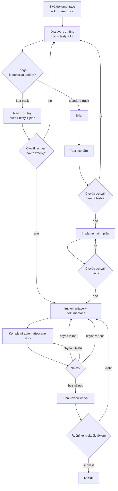
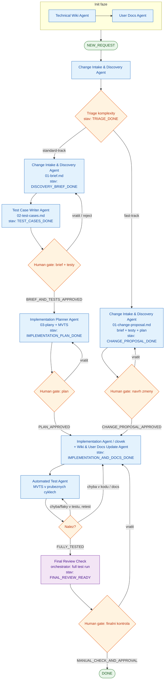
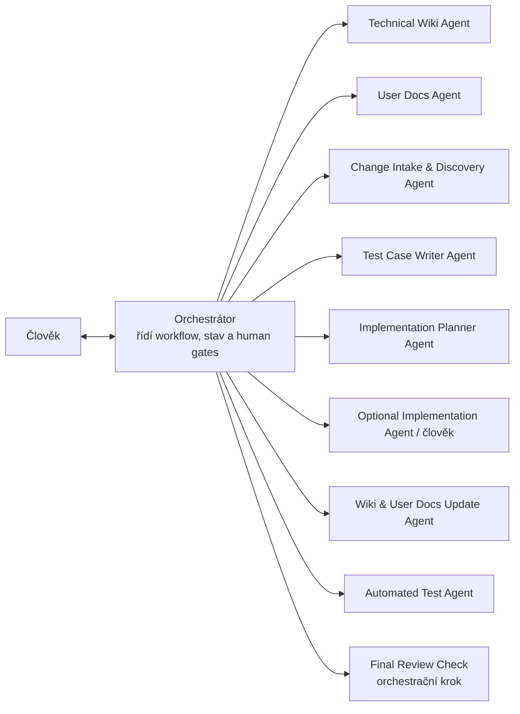
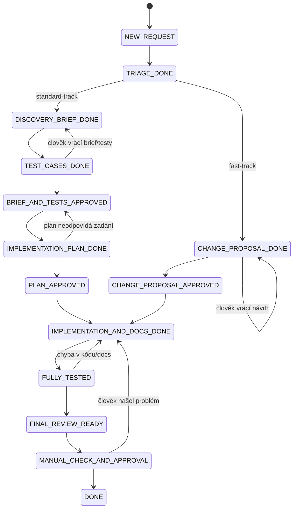

# AI-driven changes plan

> Přenosový dokument pro návrh a první implementaci lokálního AI-driven change management workflow.
>
> Tento soubor je určený jako **source of truth** pro:
>
> - vygenerování sady Claude Code agentů,
> - vytvoření `.claude/commands`,
> - nastavení lokálního workflow nad repozitářem,
> - přenos znalosti do jiného nástroje nebo dalšího chatu,
> - pozdější převod do LangGraphu, Jira workflow nebo vlastního dashboardu.

---

# 1. Executive summary

Moderní AI ve vývoji softwaru nemá být jen chytřejší našeptávač v editoru. Skutečný posun nastává ve chvíli, kdy AI pomáhá řídit celý životní cyklus změny: porozumět aplikaci, udržovat dokumentaci, analyzovat požadavek, navrhnout testovatelné zadání, připravit plán, asistovat u implementace, aktualizovat dokumentaci, spustit kompletní testy a připravit člověku finální kontrolu.

Cílem této metodiky není autonomní AI, která bez dozoru mění systém. Cílem je **řízené workflow**, kde AI dělá specializovanou práci, orchestrátor hlídá tok a člověk rozhoduje v klíčových bodech.

Základní idea:

```text
kvalitní dokumentace
→ informovaná analýza
→ testovatelné zadání
→ lidské schválení
→ plán
→ implementace spolu s dokumentací
→ kompletní automatizované testy
→ finální ruční kontrola
```

---

# 2. Hlavní teze metodiky

## 2.1 Dokumentace je základ systému

Základem workflow je kvalitní a průběžně udržovaná dokumentace:

```text
/wiki       = technická znalostní báze
/docs/user  = uživatelská dokumentace
```

Dokumentace není vedlejší výstup. Je to zdroj kontextu pro budoucí analýzy a změny.

Aby agenti nenaráželi na limity kontextového okna u velkých repozitářů, technická wiki **není jeden velký dokument, ale hierarchická struktura**:

```text
mapa modulů        → /wiki/modules/index.md
detaily modulů     → /wiki/modules/{module}.md
API endpointy      → /wiki/api/{module}.md
```

Díky tomu lze agentům předávat jen relevantní „znalostní oblasti“ místo celého popisu systému (viz triage znalostních oblastí v Discovery agentovi).

AI agenti se při práci neopírají pouze o aktuální ticket, ale o:

- technickou wiki,
- uživatelskou dokumentaci,
- zdrojový kód,
- existující testy,
- případně explorativní průchod aplikace přes Playwright.

## 2.2 Změna nezačíná kódem

Každá změna má nejdřív získat tvar:

```text
požadavek
↓
informovaný brief
↓
slovní test scénáře
↓
lidské schválení
↓
plán
↓
implementace
```

Bez briefu a test scénářů se nemá implementovat.

## 2.3 Člověk schvaluje zadání i testy dohromady

První human gate není po hrubém zadání. Člověk schvaluje až kombinaci:

- brief,
- rozsah,
- acceptance criteria,
- slovní test scénáře.

Tím se snižuje riziko, že AI nebo vývojář implementuje něco, co později nelze objektivně ověřit.

## 2.4 Dokumentace se upravuje během implementace

Aktualizace dokumentace nepatří až za testování jako dodatečný úklid.

Správný model:

```text
implementace kódu
+ úprava technické wiki
+ úprava user docs
+ screenshoty
+ release notes, pokud v projektu existují
↓
automatizované testy
↓
ruční kontrola člověkem
```

Pokud testy najdou problém, může se dokumentace ještě upravit, ale typicky už by měla být hotová spolu s implementací.

## 2.5 Testuje se chytře v průběhu, kompletně před uzavřením

Kompletní testovací sada při každé drobné iteraci je u velkých projektů neúnosná. Metodika proto rozlišuje dvě úrovně testování:

```text
průběžné cykly  → Minimal Viable Test Set (relevantní testy podle impact analysis)
před uzavřením  → full test run (kompletní sada včetně Playwright)
```

- **Minimal Viable Test Set (MVTS)** definuje `Implementation Planner Agent` na základě analýzy dopadů a zapíše jej do `03-test-automation-plan.md`. `Automated Test Agent` během průběžných cyklů spouští právě tento set, aby byla rychlá zpětná vazba.
- **Kompletní běh** je povinný a vynucuje ho orchestrátor ve fázi `Final Review Check` — teprve tehdy proběhne celá testovací sada včetně Playwright scénářů.

Zkrácení testů je tedy povolené pouze v průběžných cyklech a musí být explicitně označené jako předběžné. Kompletní běh se nikdy nevynechává; změnu nelze uzavřít bez úspěšného full test run.

## 2.6 Page Object Model není projektová paměť

Zásadní terminologické rozhodnutí:

```text
POM = Page Object Model pro Playwright testy
```

POM tedy patří do testovací vrstvy a spravuje ho `Automated Test Agent`.

Neexistuje samostatný `Project Memory Agent`.

Projektová znalostní báze je:

```text
/wiki
/docs/user
```

## 2.7 Post-change explorer není samostatný agent v MVP

Samostatný `Post-Change Explorer Agent` je pro první verzi nadbytečný.

Jeho odpovědnosti jsou rozdělené takto:

```text
Automated Test Agent
- Playwright testy
- Page Object Model
- kompletní test suite
- traces / test screenshots

Wiki & User Docs Update Agent
- finální screenshoty pro user docs
- aktualizace wiki
- aktualizace user docs
- release notes / changelog
```

## 2.8 Final review není pracovní agent

Poslední review není samostatný agent.

Je to orchestrační kontrolní krok:

```text
Final Review Check
```

Provádí ho orchestrátor.

## 2.9 Náročnost procesu odpovídá náročnosti změny

Plný proces nesmí brzdit drobné úpravy. Proto se na začátku každé změny provádí **triage** (klasifikace komplexity), která rozhodne o cestě změny:

```text
Fast-track  = nízká komplexita (překlepy, jednoduché UI změny)
Standard-track = plný proces
```

Triage provádí `Change Intake & Discovery Agent` a kritériem je především automatický odhad počtu dotčených modulů z technické wiki. U fast-track se Brief a Implementační plán slučují do jednoho kroku a člověk schvaluje rovnou „Návrh změny“. Human gates se nikdy neruší, jen se počet kroků a artefaktů přizpůsobuje riziku.

---

# 3. High-level schéma

## 3.1 Zjednodušené schéma toku



## 3.2 Kompletní flow: agenti, stavy a human gates

Tento diagram spojuje dohromady **agenty** (modře), **human gates** (oranžově), **orchestrační krok** (fialově) a **stavy**, do kterých se workflow posouvá (zeleně + popisky na hranách). Je v něm vidět triage rozdělení na fast-track / standard-track i návratové smyčky.



---

# 4. Role v systému



Orchestrátor:

- zná celé workflow,
- průběžně kontroluje výstupy,
- vybírá další krok,
- spouští správného agenta,
- ptá se člověka při nejasnostech,
- vrací úkol zpět agentovi, když výstup chybí nebo nesedí,
- nepřeskakuje human gates,
- nesmí sám schvalovat.

---

# 5. Finální sada agentů

## 5.1 Init fáze

Init fáze má pouze dva agenty.

### Technical Wiki Agent

Sloučení původního:

```text
Repository Mapper Agent
+ Wiki Init Agent
```

Úkol:

- zmapovat repozitář,
- popsat architekturu,
- popsat moduly,
- popsat routing,
- popsat API,
- popsat datové vrstvy,
- popsat testovací infrastrukturu,
- vytvořit technickou LLM wiki,
- uspořádat wiki do hierarchické struktury (mapa modulů → detaily modulů → API endpointy).

Výstupy (hierarchická struktura):

```text
/wiki/index.md
/wiki/architecture/overview.md
/wiki/modules/index.md          = mapa modulů (rozcestník)
/wiki/modules/{module}.md       = detail konkrétního modulu
/wiki/api/index.md              = přehled API
/wiki/api/{module}.md           = endpointy konkrétního modulu
/wiki/tests/index.md
/wiki/domain/glossary.md
```

`modules/index.md` slouží jako mapa, ze které lze adresovat jednotlivé moduly a jejich API bez načítání celé wiki najednou.

### User Docs Agent

Sloučení původního:

```text
UI Explorer Agent
+ User Documentation Agent
```

Úkol:

- spustit nebo použít běžící aplikaci,
- projít UI přes Playwright,
- popsat obrazovky,
- popsat hlavní uživatelská flow,
- pořídit screenshoty,
- vytvořit nebo aktualizovat user docs.

Výstupy:

```text
/wiki/ui/screens.md
/wiki/ui/user-flows.md
/docs/user/index.md
/docs/user/{flow}.md
/docs/user/screenshots/
```

## 5.2 Change management fáze

### Change Intake & Discovery Agent

Úkol:

- vzít hrubý požadavek,
- z mapy modulů (`/wiki/modules/index.md`) **identifikovat relevantní znalostní oblasti** a načíst jen je,
- projít relevantní části wiki,
- projít user docs,
- projít relevantní zdrojový kód,
- projít existující testy,
- podle potřeby projít UI přes Playwright,
- provést **triage** (klasifikaci komplexity změny),
- ptát se člověka při nejasnostech,
- vytvořit jeden informovaný brief.

Výstupy:

```text
/changes/{ticket-id}/01-brief.md
```

#### Triage (klasifikace komplexity)

Hned v prvním kroku agent odhadne komplexitu změny a zařadí ji do jedné ze dvou cest:

```text
fast-track     = nízká komplexita
standard-track = plný proces
```

Kritérium výběru:

- **automatický odhad počtu dotčených modulů** z technické wiki (primární signál),
- typ změny (oprava překlepu, jednoduchá UI úprava vs. změna business logiky, datového modelu nebo API),
- riziko a rozsah dopadu na existující testy.

Doporučené pravidlo:

```text
fast-track:     dotčen ~1 modul, bez změny datového modelu/API, nízké riziko
standard-track: 2+ dotčené moduly, změna business logiky/dat/API, nejasné nebo rizikové dopady
```

Výsledek triage agent zapíše do sekce `Triage Classification` v `01-brief.md` (včetně seznamu dotčených modulů, který slouží jako seznam relevantních **znalostních oblastí**). Při pochybnostech volí vždy `standard-track`. Triage navrhuje agent, ale člověk ji při schválení může změnit.

Orchestrátor pak následným agentům (Planner, Implementation, Test) předává pouze ty části wiki, které odpovídají dotčeným modulům (`/wiki/modules/{module}.md`, `/wiki/api/{module}.md`), místo celého popisu systému.

U **fast-track** se Brief a Implementační plán slučují do jednoho artefaktu („Návrh změny“) a slovní test scénáře jsou minimální; člověk schvaluje rovnou tento návrh a jde se do implementace. U **standard-track** běží plný proces tak, jak je popsán dále v metodice.

Volitelné podpůrné artefakty:

```text
/changes/{ticket-id}/screenshots/
```

Důležité rozhodnutí:

```text
Nepovinné samostatné soubory jako 00-change-meta.md nebo 01-current-state-discovery.md se v MVP nevytváří.
Jejich obsah je sekcí uvnitř 01-brief.md.
```

### Test Case Writer Agent

Úkol:

- vyjít z hotového briefu,
- vytvořit slovní test scénáře,
- nepřepisovat brief,
- neimplementovat,
- nepsat Playwright testy,
- připravit dokument, který člověk může upravit před schválením.

Výstup:

```text
/changes/{ticket-id}/02-test-cases.md
```

Důležité rozhodnutí:

```text
Nevznikají samostatné soubory 02-acceptance-scenarios.md nebo 02-regression-scenarios.md.
Vše je v jednom 02-test-cases.md.
```

### Implementation Planner Agent

Úkol:

- vyjít ze schváleného briefu a test scénářů,
- vytvořit implementační plán,
- rozdělit dopady na kód, testy a dokumentaci,
- určit pravděpodobně měněné soubory,
- na základě analýzy dopadů (impact analysis) definovat **Minimal Viable Test Set (MVTS)** pro průběžné cykly,
- navrhnout test automation plan,
- navrhnout docs update plan,
- neimplementovat.

Výstupy:

```text
/changes/{ticket-id}/03-implementation-plan.md
/changes/{ticket-id}/03-file-change-plan.md
/changes/{ticket-id}/03-test-automation-plan.md
/changes/{ticket-id}/03-docs-update-plan.md
```

### Optional Implementation Agent / člověk

Úkol:

- implementovat pouze schválený plán,
- držet se scope,
- nedělat vedlejší refaktoring,
- zapisovat odchylky od plánu,
- při větší odchylce se ptát člověka.

Výstupy:

```text
změny v kódu
/changes/{ticket-id}/04-implementation-notes.md
/changes/{ticket-id}/04-changed-files.md
/changes/{ticket-id}/04-deviations-from-plan.md
```

Implementaci může udělat:

```text
- člověk ručně,
- Claude Code agent,
- kombinace obojího.
```

### Wiki & User Docs Update Agent

Tento agent je součást implementační fáze, ne až post-test fáze.

Úkol:

- aktualizovat technickou wiki,
- aktualizovat user docs,
- pořídit nebo vybrat finální screenshoty,
- aktualizovat release notes / changelog, pokud v projektu existují,
- zapsat, co bylo změněno v dokumentaci,
- označit případné nejasnosti.

Výstupy:

```text
updated /wiki
updated /docs/user
updated release notes / changelog, pokud existuje
/docs/user/screenshots/
/changes/{ticket-id}/04-docs-update-summary.md
```

### Automated Test Agent

Úkol:

- vyjít ze schválených slovních test scénářů,
- upravit nebo vytvořit Playwright testy,
- upravit Page Object Model,
- v průběžných cyklech spouštět **Minimal Viable Test Set** (relevantní testy podle `03-test-automation-plan.md`),
- před uzavřením spustit **kompletní testovací sadu** (vynucuje orchestrátor ve Final Review Check),
- při selhání testu nejprve provést **„Retest“** a analýzu, zda selhal kód, nebo samotný test (např. kvůli nekonzistentnímu UI),
- zapsat report,
- rozlišit chybu aplikace, chybu testu, flaky test a problém dokumentace,
- explicitně označit flaky testy včetně výsledku retestu, aby člověk při finální kontrole neztrácel čas falešnými poplachy.

Výstupy:

```text
nové/upravené testy
upravený Page Object Model
/changes/{ticket-id}/05-full-test-run-report.md
/changes/{ticket-id}/05-failures.md
/changes/{ticket-id}/traces/
```

---

# 6. Human gates

Workflow obsahuje tyto lidské brány.

## 6.1 Otázky během discovery

Kdykoliv `Change Intake & Discovery Agent` narazí na nejasnost, orchestrátor má zastavit tok a zeptat se člověka.

Příklady:

- nejasné business pravidlo,
- více možných výkladů požadavku,
- chybějící acceptance criteria,
- riziková domněnka,
- nejasná role uživatele,
- nejasný vztah k existujícímu chování.

## 6.2 Brief + tests approval

Po dokončení:

```text
01-brief.md
02-test-cases.md
```

nastane human gate:

```text
BRIEF_AND_TESTS_APPROVED
```

Člověk může:

```text
approve
request changes
reject
```

## 6.3 Plan approval

Po dokončení implementačního plánu nastane:

```text
PLAN_APPROVED
```

Bez tohoto schválení se neimplementuje.

## 6.4 Final manual check

Po implementaci, dokumentaci a testech proběhne:

```text
MANUAL_CHECK_AND_APPROVAL
```

Člověk:

- projde checklist,
- zkontroluje test report,
- případně projde aplikaci ručně,
- ověří dokumentaci,
- rozhodne o merge / release / uzavření ticketu.

---

# 7. Stavový model

## 7.1 Lidsky pojmenovaný flow

Standard-track:

```text
Máme požadavek
↓
Triage zařadila změnu jako standard-track
↓
Brief je hotový
↓
Test scénáře jsou hotové
↓
Člověk schválil brief a testy
↓
Plán je hotový
↓
Člověk schválil plán
↓
Implementace a dokumentace jsou hotové
↓
Kompletní testy proběhly
↓
Proběhla finální kontrola člověkem
↓
Změna je hotová
```

Fast-track:

```text
Máme požadavek
↓
Triage zařadila změnu jako fast-track
↓
Návrh změny je hotový (brief + testy + plán v jednom)
↓
Člověk schválil návrh změny
↓
Implementace a dokumentace jsou hotové
↓
Kompletní testy proběhly
↓
Proběhla finální kontrola člověkem
↓
Změna je hotová
```

## 7.2 Technické stavy

```text
NEW_REQUEST
TRIAGE_DONE

# standard-track
DISCOVERY_BRIEF_DONE
TEST_CASES_DONE
BRIEF_AND_TESTS_APPROVED
IMPLEMENTATION_PLAN_DONE
PLAN_APPROVED

# fast-track (Brief + testy + plán sloučeny do "Návrhu změny")
CHANGE_PROPOSAL_DONE
CHANGE_PROPOSAL_APPROVED

# společné
IMPLEMENTATION_AND_DOCS_DONE
FULLY_TESTED
FINAL_REVIEW_READY
MANUAL_CHECK_AND_APPROVAL
DONE
REJECTED
BLOCKED
```

Po triage se tok rozdělí. Po `PLAN_APPROVED` (standard-track) i `CHANGE_PROPOSAL_APPROVED` (fast-track) se sbíhá do společného `IMPLEMENTATION_AND_DOCS_DONE`.

## 7.3 Mermaid stavový diagram



---

# 8. Artefakty

## 8.1 Doporučená struktura repozitáře

```text
/wiki
  index.md
  architecture/
    overview.md
  modules/
    index.md          # mapa modulů (rozcestník)
    {module}.md       # detail konkrétního modulu
  api/
    index.md          # přehled API
    {module}.md       # endpointy konkrétního modulu
  tests/
    index.md
  domain/
    glossary.md
  ui/
    screens.md
    user-flows.md

/docs
  /user
    index.md
    screenshots/

/changes
  /{ticket-id}
    change-state.json
    01-brief.md
    01-change-proposal.md        # pouze fast-track (brief + testy + plán)
    02-test-cases.md
    03-implementation-plan.md
    03-file-change-plan.md
    03-test-automation-plan.md
    03-docs-update-plan.md
    04-implementation-notes.md
    04-changed-files.md
    04-deviations-from-plan.md
    04-docs-update-summary.md
    05-full-test-run-report.md
    05-failures.md
    06-final-review.md
    06-approval-checklist.md
    screenshots/
    traces/

/.claude
  /agents
  /commands

CLAUDE.md
```

---

# 9. Templaty hlavních souborů

## 9.1 `01-brief.md`

```md
# Change Brief: {ticket-id}

## 0. Triage Classification

<!-- machine-readable, validovatelné orchestrátorem -->
```yaml
track: fast-track | standard-track
estimated_affected_modules: <number>
affected_modules: []
change_type: typo | simple-ui | business-logic | data-model | api | other
risk_level: low | medium | high
rationale: >
  Krátké zdůvodnění výběru cesty.
```

## 1. Request Summary

## 2. Business Goal

## 3. Current State Discovery

### From technical wiki

### From user docs

### From source code

### From tests

### From UI exploration, if used

## 4. Affected Areas

## 5. Proposed Scope

## 6. Out of Scope

## 7. Risks

## 8. Open Questions

## 9. Human Answers / Decisions

## 10. Acceptance Criteria

## 11. Notes for Test Case Writer
```

## 9.2 `02-test-cases.md`

```md
# Test Cases: {ticket-id}

## 1. Test Strategy Summary

## 2. Acceptance Scenarios

## 3. Happy Path Scenarios

## 4. Edge Cases

## 5. Regression Scenarios

## 6. Permissions / Roles

## 7. Validation Rules

## 8. Test Data Notes

## 9. Manual Test Notes

## 10. Automation Notes for Automated Test Agent
```

## 9.3 `03-implementation-plan.md`

```md
# Implementation Plan: {ticket-id}

## 1. Summary

## 2. Assumptions

## 3. Frontend Changes

## 4. Backend Changes

## 5. Database / Data Changes

## 6. Configuration Changes

## 7. Test Changes

## 8. Documentation Changes

## 9. Risks and Rollback Notes

## 10. Step-by-step Plan
```

## 9.4 `04-implementation-notes.md`

```md
# Implementation Notes: {ticket-id}

## 1. Summary of Implemented Changes

## 2. Files Changed

## 3. Deviations from Approved Plan

## 4. Questions Raised During Implementation

## 5. Notes for Test Agent

## 6. Notes for Documentation
```

## 9.5 `04-docs-update-summary.md`

```md
# Docs Update Summary: {ticket-id}

## 1. Technical Wiki Updated

## 2. User Docs Updated

## 3. Screenshots Added or Replaced

## 4. Release Notes / Changelog Updated

## 5. Documentation Gaps or Uncertainty
```

## 9.6 `05-full-test-run-report.md`

```md
# Full Test Run Report: {ticket-id}

## 1. Test Commands Run

## 2. Environment

## 3. Summary Result

## 4. Passing Suites

## 5. Failing Suites

## 6. Playwright Results

## 7. Page Object Model Changes

## 8. Flaky Tests & Retest Analysis

<!-- Pro každé selhání: proběhl retest? selhal kód, nebo test? -->
<!-- Cílem je, aby člověk při finální kontrole neřešil falešné poplachy. -->

| Test | Retest proveden | Verdikt (code/test/flaky/docs) | Poznámka |
|------|-----------------|--------------------------------|----------|

## 9. Failures Requiring Implementation Changes

## 10. Failures Requiring Test Changes

## 11. Failures Requiring Documentation Changes
```

## 9.7 `06-final-review.md`

```md
# Final Review: {ticket-id}

## 1. Required Artifacts Check

## 2. Human Gates Check

## 3. Scope Check

## 4. Implementation Check

## 5. Documentation Check

## 6. Test Report Check

## 7. Known Risks

## 8. Manual Check Instructions

## 9. Final Recommendation
```

## 9.8 Strojově čitelné sekce a validační schémata

Každý hlavní artefakt musí kromě lidsky čitelného textu obsahovat **strojově čitelnou sekci** (fenced blok ```yaml nebo ```json) s povinnými poli. Orchestrátor tuto sekci validuje proti schématu artefaktu a teprve po úspěšné validaci posune tok dál nebo zapojí člověka.

Pravidla:

- strojově čitelný blok je v artefaktu právě jeden a má stabilní strukturu,
- chybějící nebo prázdné povinné pole = automatické vrácení agentovi (před zapojením člověka),
- schémata jsou verzovaná spolu s metodikou.

### `01-brief.md`

```yaml
artifact: brief
schema_version: 1
ticket_id: <string>            # required
triage:                        # required
  track: fast-track | standard-track
  estimated_affected_modules: <number>
  affected_modules: []
acceptance_criteria: []        # required, non-empty
scope: []                      # required
out_of_scope: []
open_questions: []
risks: []
```

### `02-test-cases.md`

```yaml
artifact: test_cases
schema_version: 1
ticket_id: <string>            # required
acceptance_scenarios: []       # required, non-empty
regression_scenarios: []
edge_cases: []
automation_notes: <string>
```

### `03-implementation-plan.md`

```yaml
artifact: implementation_plan
schema_version: 1
ticket_id: <string>            # required
steps: []                      # required, non-empty
likely_changed_files: []       # required
minimal_viable_test_set: []    # required
risks: []
```

### `05-full-test-run-report.md`

```yaml
artifact: full_test_run_report
schema_version: 1
ticket_id: <string>            # required
full_run_executed: true | false   # required
result: pass | fail               # required
failures:
  code: []
  test: []
  docs: []
flaky:                            # viz 9.6 / feedback loop
  - test: <string>
    retested: true | false
    verdict: code | test | flaky | docs
```

### `06-final-review.md`

```yaml
artifact: final_review
schema_version: 1
ticket_id: <string>               # required
required_artifacts_present: true | false   # required
human_gates_ok: true | false               # required
full_test_run_ok: true | false             # required
recommendation: approve | return | block   # required
```

---

# 10. Lokální MVP v Claude Code

## 10.1 Cíl první implementace

První implementace má být jednoduchá a lokální.

Cíl:

```text
ověřit metodiku a agentní prompty
bez serveru
bez dashboardu
bez Jira integrace jako nutné podmínky
```

Claude Code v této fázi slouží jako:

```text
lokální orchestrátor + spouštěč specializovaných agentů
```

## 10.2 Struktura `.claude`

```text
.claude/
  agents/
    technical-wiki.md
    user-docs.md
    change-intake-discovery.md
    test-case-writer.md
    implementation-planner.md
    optional-implementation.md
    wiki-user-docs-update.md
    automated-test.md

  commands/
    init-project.md
    start-change.md
    continue-change.md
    approve-brief-tests.md
    approve-change-proposal.md
    approve-plan.md
    final-check.md
```

## 10.3 `CLAUDE.md`

`CLAUDE.md` má definovat hlavní orchestrátorská pravidla.

Doporučený obsah:

```md
# Local AI Change Orchestrator

You are the main orchestrator of the local AI-driven change workflow.

You know the full workflow:

1. Technical wiki and user docs are created and maintained.
2. A raw change request is converted into an informed brief.
3. Test scenarios are written before implementation.
4. The human approves brief and test scenarios together.
5. An implementation plan is created.
6. The human approves the implementation plan.
7. Implementation and documentation are updated together.
8. The full automated test suite is run.
9. Final review check is prepared.
10. The human performs final manual approval.

You do not skip human gates.

You do not implement unless the implementation plan has been approved.

You do not merge, release, delete, migrate data, or make destructive changes.

You keep all change-specific artifacts in:

/changes/{ticket-id}

You keep all change state and artifacts on a dedicated feature branch:

change/{ticket-id}

Before continuing a change you verify the developer is on the correct branch and pull
the latest state from the remote. After each significant step you commit and push the
updated state. You never overwrite diverging state; you ask the human to resolve it.

You use the specialized agents when possible:

- Technical Wiki Agent
- User Docs Agent
- Change Intake & Discovery Agent
- Test Case Writer Agent
- Implementation Planner Agent
- Optional Implementation Agent
- Wiki & User Docs Update Agent
- Automated Test Agent

You continuously check:

- whether the expected output file exists,
- whether it is specific enough,
- whether it contains a valid machine-readable section matching the artifact schema,
- whether all mandatory fields are filled (e.g. acceptance criteria, triage),
- whether the next step is allowed,
- whether a human decision is required,
- whether a task should be returned to a previous agent.

You validate every agent artifact against its schema before involving the human. If a
mandatory field is missing, you return the task to the agent first, and only surface
validated artifacts to the human.

If information is missing or risky assumptions would be required, ask the human.
```

---

# 11. Lokální stav změny

Každá změna má mít:

```text
/changes/{ticket-id}/change-state.json
```

## 11.1 Stav žije ve vlastní Git větvi

Spoléhání na čistě lokální `change-state.json` je rizikové pro týmovou spolupráci. Proto:

- celá složka `/changes/{ticket-id}` (včetně `change-state.json` a všech artefaktů) je **vždy součástí vlastní feature branch** pro daný úkol,
- doporučená konvence pojmenování větve:

```text
change/{ticket-id}
```

- stav se nepřenáší kopírováním souborů mezi vývojáři, ale výhradně přes Git (commit + push + pull),
- orchestrátor po každém významném kroku (dokončení artefaktu, změna stavu, human gate) stav **commitne** do větve změny.

Tím se předejde konfliktům, které by vznikaly při ručním kopírování souborů, a stav změny je auditovatelný a sdílený přes repozitář.

Příklad:

```json
{
  "ticketId": "JIRA-123",
  "title": "Add customer priority to order",
  "branch": "change/JIRA-123",
  "track": "standard-track",
  "status": "TEST_CASES_DONE",
  "currentStep": "awaiting_brief_and_tests_approval",
  "artifacts": {
    "brief": "01-brief.md",
    "testCases": "02-test-cases.md",
    "implementationPlan": null,
    "testReport": null,
    "finalReview": null
  },
  "approvals": {
    "briefAndTests": null,
    "implementationPlan": null,
    "finalManualCheck": null
  },
  "openQuestions": [],
  "knownRisks": [],
  "lastUpdatedBy": "orchestrator"
}
```

---

# 12. Claude Code commands

## 12.1 `/init-project`

Úkol:

- spustit Technical Wiki Agent,
- potom User Docs Agent,
- ověřit, že vznikla wiki a user docs.

Výsledek:

```text
/wiki
/docs/user
```

## 12.2 `/start-change {ticket-id} {request}`

Úkol:

- vytvořit (nebo přepnout na) feature branch `change/{ticket-id}`,
- vytvořit složku `/changes/{ticket-id}`,
- vytvořit `change-state.json` (včetně pole `branch`),
- spustit Change Intake & Discovery Agent,
- nechat agenta provést **triage** a zapsat ji do `01-brief.md`,
- podle výsledku triage zvolit cestu:
  - **standard-track:** vytvořit `01-brief.md`, spustit Test Case Writer Agent, vytvořit `02-test-cases.md`,
  - **fast-track:** vytvořit `01-change-proposal.md` (sloučený brief + testy + plán),
- zastavit se na human gate.

Výsledný stav:

```text
standard-track: TEST_CASES_DONE
fast-track:     CHANGE_PROPOSAL_DONE
```

## 12.3 `/continue-change {ticket-id}`

Úkol:

- ověřit, že je vývojář na správné větvi `change/{ticket-id}`; pokud ne, na ni přepnout,
- provést `git pull` aktuálního stavu větve z repozitáře (aby se předešlo konfliktům),
- přečíst `change-state.json`,
- určit další povolený krok,
- spustit správného agenta,
- nepřeskakovat human gates,
- po dokončení kroku stav commitnout a pushnout do větve změny.

Pokud lokální stav neodpovídá vzdálenému (rozbíhající se historie), orchestrátor se zastaví a vyžádá si vyřešení od člověka, místo aby stav přepsal.

## 12.4 `/approve-brief-tests {ticket-id}`

Pro **standard-track**.

Úkol:

- ověřit, že existuje `01-brief.md`,
- ověřit, že existuje `02-test-cases.md`,
- nastavit `BRIEF_AND_TESTS_APPROVED`,
- spustit Implementation Planner Agent.

## 12.4b `/approve-change-proposal {ticket-id}`

Pro **fast-track**.

Úkol:

- ověřit, že existuje `01-change-proposal.md`,
- ověřit, že obsahuje brief, test scénáře i implementační plán,
- nastavit `CHANGE_PROPOSAL_APPROVED`,
- připravit implementační fázi (bez samostatného plánovacího kroku).

## 12.5 `/approve-plan {ticket-id}`

Úkol:

- ověřit, že existuje implementační plán,
- nastavit `PLAN_APPROVED`,
- připravit implementační fázi.

## 12.6 `/final-check {ticket-id}`

Úkol:

- vynutit přes Automated Test Agent **kompletní testovací běh** (full test run včetně Playwright scénářů),
- ověřit, že full test run proběhl a je zachycen v `05-full-test-run-report.md`,
- provést Final Review Check,
- ověřit artefakty,
- připravit checklist pro člověka,
- nesměřovat automaticky do merge.

---

# 13. Definice agentů pro vygenerování `.claude/agents`

Níže uvedené bloky jsou koncepční specifikace. Lze je převést do konkrétních `.md` souborů pro Claude Code agenty.

Každý agent, který produkuje hlavní artefakt, musí do něj zapsat **strojově čitelnou sekci** podle schématu daného artefaktu (viz 9.8). Orchestrátor ji validuje před posunem toku dál.

## 13.1 `technical-wiki.md`

```yaml
id: technical_wiki
name: Technical Wiki Agent
purpose: >
  Create and maintain the technical LLM wiki for the project.

inputs:
  - repository files
  - README files
  - package/build/config files
  - existing documentation
  - existing tests

outputs:
  - wiki/index.md
  - wiki/architecture/overview.md
  - wiki/modules/index.md      # module map (entry point)
  - wiki/modules/{module}.md   # per-module detail
  - wiki/api/index.md          # API overview
  - wiki/api/{module}.md       # per-module endpoints
  - wiki/tests/index.md
  - wiki/domain/glossary.md

allowed_actions:
  - read repository files
  - inspect configuration
  - inspect tests
  - create or update markdown documentation under /wiki

forbidden_actions:
  - implement product changes
  - modify application source code
  - delete files
  - change tests unless explicitly instructed

success_criteria:
  - wiki describes the current architecture
  - wiki is organized hierarchically (module map -> module details -> API endpoints)
  - key modules and APIs are identified
  - test structure is documented
  - unknowns are explicitly marked
```

## 13.2 `user-docs.md`

```yaml
id: user_docs
name: User Docs Agent
purpose: >
  Create and maintain user-facing documentation based on real UI exploration.

inputs:
  - app_url
  - running local application
  - test user credentials, if available
  - technical wiki
  - existing user docs

outputs:
  - wiki/ui/screens.md
  - wiki/ui/user-flows.md
  - docs/user/index.md
  - docs/user/*.md
  - docs/user/screenshots/

allowed_actions:
  - use Playwright for UI exploration
  - take screenshots
  - create and update user documentation

forbidden_actions:
  - modify application source code
  - invent unavailable UI behavior
  - document uncertain behavior as fact

success_criteria:
  - main screens are documented
  - main user flows are documented
  - screenshots are stored and referenced
  - unclear or inaccessible areas are marked
```

## 13.3 `change-intake-discovery.md`

```yaml
id: change_intake_discovery
name: Change Intake & Discovery Agent
purpose: >
  Convert a raw change request into one informed brief, and triage its complexity
  (fast-track vs standard-track) based on the estimated number of affected modules.

inputs:
  - raw change request
  - ticket_id
  - wiki
  - docs/user
  - source code
  - existing tests
  - app_url, optional
  - human answers

outputs:
  - changes/{ticket-id}/01-brief.md          # standard-track
  - changes/{ticket-id}/01-change-proposal.md # fast-track (brief + tests + plan)
  - changes/{ticket-id}/screenshots/, optional

triage:
  criterion_primary: estimated number of affected modules from the technical wiki
  criteria_secondary:
    - change type (typo / simple UI vs business logic / data / API)
    - risk and impact on existing tests
  rules:
    fast_track: ~1 module, no data-model/API change, low risk
    standard_track: 2+ modules, business/data/API change, unclear or risky impact
  on_doubt: choose standard-track
  output_section: "Triage Classification (machine-readable YAML in the brief)"

human_in_the_loop:
  during_agent: true
  ask_when:
    - requirement is ambiguous
    - business rule is unclear
    - multiple interpretations exist
    - acceptance criteria cannot be derived
    - risky assumption would be required

allowed_actions:
  - read wiki
  - read user docs
  - inspect source code
  - inspect tests
  - optionally explore UI with Playwright
  - ask the human questions
  - write 01-brief.md

forbidden_actions:
  - implement code
  - write automated tests
  - create implementation plan
  - silently assume risky business rules

success_criteria:
  - 01-brief.md (or 01-change-proposal.md for fast-track) exists
  - triage classification is present and machine-readable
  - relevant knowledge areas (affected modules) are identified for scoped wiki handoff
  - current state is described
  - scope and out-of-scope are clear
  - acceptance criteria are present
  - open questions and human answers are recorded
```

## 13.4 `test-case-writer.md`

```yaml
id: test_case_writer
name: Test Case Writer Agent
purpose: >
  Create one human-readable test case document from the ready brief.

inputs:
  - changes/{ticket-id}/01-brief.md
  - wiki
  - docs/user
  - existing tests
  - human answers

outputs:
  - changes/{ticket-id}/02-test-cases.md

allowed_actions:
  - read brief
  - read documentation
  - inspect existing tests
  - write test scenarios in markdown

forbidden_actions:
  - implement code
  - write Playwright tests
  - change Page Object Model
  - change brief unless explicitly instructed

success_criteria:
  - 02-test-cases.md exists
  - happy paths are covered
  - edge cases are covered
  - regression scenarios are covered
  - roles and permissions are considered
  - automation notes are included
```

## 13.5 `implementation-planner.md`

```yaml
id: implementation_planner
name: Implementation Planner Agent
purpose: >
  Create a concrete implementation plan after brief and test scenarios are approved.

inputs:
  - changes/{ticket-id}/01-brief.md
  - changes/{ticket-id}/02-test-cases.md
  - technical wiki
  - project rules

outputs:
  - changes/{ticket-id}/03-implementation-plan.md
  - changes/{ticket-id}/03-file-change-plan.md
  - changes/{ticket-id}/03-test-automation-plan.md
  - changes/{ticket-id}/03-docs-update-plan.md

allowed_actions:
  - inspect source code
  - inspect tests
  - inspect docs
  - write plan files

forbidden_actions:
  - implement code
  - modify tests
  - modify docs
  - skip plan approval

success_criteria:
  - implementation steps are clear
  - likely files are listed
  - test automation plan exists
  - minimal viable test set is defined from impact analysis
  - docs update plan exists
  - risks are recorded
```

## 13.6 `optional-implementation.md`

```yaml
id: optional_implementation
name: Optional Implementation Agent
purpose: >
  Implement the approved plan when the human chooses AI-assisted implementation.

inputs:
  - approved implementation plan
  - file change plan
  - source code
  - coding rules

outputs:
  - code changes
  - changes/{ticket-id}/04-implementation-notes.md
  - changes/{ticket-id}/04-changed-files.md
  - changes/{ticket-id}/04-deviations-from-plan.md

allowed_actions:
  - modify application source code within approved scope
  - make small focused changes
  - update implementation notes

forbidden_actions:
  - change scope without approval
  - perform broad refactoring
  - run destructive operations
  - modify production data
  - skip documentation phase

success_criteria:
  - changes match approved plan
  - changed files are documented
  - deviations are explicitly recorded
  - no unrelated changes are introduced
```

## 13.7 `wiki-user-docs-update.md`

```yaml
id: wiki_user_docs_update
name: Wiki & User Docs Update Agent
purpose: >
  Update technical wiki, user docs, screenshots, and release notes during the implementation phase.

inputs:
  - 01-brief.md
  - 03-docs-update-plan.md
  - 04-implementation-notes.md
  - final UI state
  - existing wiki
  - existing user docs
  - release notes or changelog, if present

outputs:
  - updated wiki
  - updated docs/user
  - screenshots
  - updated release notes or changelog, if present
  - changes/{ticket-id}/04-docs-update-summary.md

allowed_actions:
  - update markdown docs
  - take or update screenshots
  - update changelog/release notes if present

forbidden_actions:
  - implement application logic
  - invent behavior not verified in app/code
  - mark uncertain documentation as certain

success_criteria:
  - changed behavior is documented
  - user docs reflect the final UI
  - screenshots are current
  - release notes are updated when applicable
  - docs update summary exists
```

## 13.8 `automated-test.md`

```yaml
id: automated_test
name: Automated Test Agent
purpose: >
  Create/update automated tests, update Playwright Page Object Model, and run the full test suite.

inputs:
  - 02-test-cases.md
  - 03-test-automation-plan.md
  - 04-implementation-notes.md
  - existing automated tests
  - existing Page Object Model

outputs:
  - new or updated test files
  - updated Page Object Model
  - changes/{ticket-id}/05-full-test-run-report.md
  - changes/{ticket-id}/05-failures.md
  - traces or test artifacts

allowed_actions:
  - modify test files
  - modify Page Object Model
  - run the Minimal Viable Test Set during preliminary/iterative cycles
  - run full test suite (mandatory before closing, enforced at Final Review Check)
  - re-run (retest) failing tests to detect flakiness
  - record test results

feedback_loop:
  on_failure:
    - retest the failing test
    - analyze whether the code failed or the test itself failed (e.g. inconsistent UI)
    - record verdict (code | test | flaky | docs) in 05-full-test-run-report.md
  goal: avoid false alarms for the human during final review

forbidden_actions:
  - silently reduce test scope
  - run only relevant tests unless explicitly marked as preliminary
  - skip the full test run before closing the change
  - change production logic unless separately authorized
  - hide failing tests

success_criteria:
  - preliminary cycles ran the Minimal Viable Test Set
  - a full test run was executed before final review
  - test results are recorded
  - failures are categorized
  - failing tests were retested and verdict (code/test/flaky/docs) recorded
  - Page Object Model changes are documented
  - flaky tests are identified
```

---

# 14. Orchestrátor: rozhodovací pravidla

## 14.1 Nikdy nepřeskakovat human gates

Zakázané:

```text
NEW_REQUEST → IMPLEMENTATION_PLAN_DONE
TEST_CASES_DONE → PLAN_APPROVED
PLAN_APPROVED → DONE
```

## 14.2 Vracet práci zpět podle typu nálezu

```text
nejasné zadání
→ Change Intake & Discovery Agent / člověk

chybné nebo slabé test scénáře
→ Test Case Writer Agent

plán neodpovídá schválenému briefu
→ Implementation Planner Agent

implementace se odchyluje od plánu
→ člověk / Implementation Agent

test fail (nejprve retest + analýza příčiny)
→ verdikt rozhoduje o směru návratu

test fail kvůli aplikaci
→ Implementation Agent / člověk

test fail kvůli testu / flaky
→ Automated Test Agent

dokumentace neodpovídá realitě
→ Wiki & User Docs Update Agent
```

## 14.3 Kontrolovat artefakty

Místo spoléhání na obecná pravidla v `CLAUDE.md` orchestrátor provádí **přísnou validaci artefaktů proti schématu**.

Každý výstup agenta (např. `01-brief.md`) musí obsahovat **strojově čitelnou sekci** (YAML nebo JSON s povinnými poli), kterou orchestrátor zvaliduje proti předem definovanému schématu pro daný artefakt.

Před přechodem na další krok orchestrátor ověřuje:

- soubor existuje,
- soubor není prázdný,
- soubor není pouze obecný text,
- obsahuje očekávané sekce,
- **obsahuje strojově čitelný blok a ten je validní vůči schématu artefaktu**,
- **všechna povinná pole jsou vyplněná** (např. Acceptance Criteria, Triage Classification),
- neobsahuje zásadní otevřené otázky bez odpovědi,
- odpovídá předchozímu schválenému rozsahu.

Pokud agent nepředloží všechna povinná pole, orchestrátor mu úkol **vrátí k dopracování ještě předtím, než o tom informuje člověka**. Člověk se zapojuje až u validních artefaktů.

## 14.4 Předávat jen relevantní kontext

Technická wiki je hierarchická. Orchestrátor nenačítá celý popis systému, ale:

- z `/wiki/modules/index.md` zjistí mapu modulů,
- podle dotčených modulů z triage vybere relevantní znalostní oblasti,
- následným agentům (Planner, Implementation, Test) předá pouze odpovídající `/wiki/modules/{module}.md` a `/wiki/api/{module}.md`.

Tím se šetří kontextové okno a snižuje riziko zahlcení agenta nesouvisejícími informacemi.

## 14.5 Pracovat s nejistotou

Agent nemá předstírat jistotu.

Pokud něco není jasné, výstup musí obsahovat:

```text
Open Questions
Assumptions
Risks
Needs Human Decision
```

---

# 15. První implementační backlog

## 15.1 Repo setup

- [ ] Vytvořit `CLAUDE.md`
- [ ] Vytvořit `.claude/agents`
- [ ] Vytvořit `.claude/commands`
- [ ] Vytvořit `/wiki`
- [ ] Vytvořit `/docs/user`
- [ ] Vytvořit `/changes`

## 15.2 Agenti

- [ ] technical-wiki.md
- [ ] user-docs.md
- [ ] change-intake-discovery.md
- [ ] test-case-writer.md
- [ ] implementation-planner.md
- [ ] optional-implementation.md
- [ ] wiki-user-docs-update.md
- [ ] automated-test.md

## 15.3 Commands

- [ ] init-project.md
- [ ] start-change.md
- [ ] continue-change.md
- [ ] approve-brief-tests.md
- [ ] approve-change-proposal.md
- [ ] approve-plan.md
- [ ] final-check.md

## 15.4 Artefakty

- [ ] Template pro `01-brief.md`
- [ ] Template pro `02-test-cases.md`
- [ ] Template pro `03-implementation-plan.md`
- [ ] Template pro `04-implementation-notes.md`
- [ ] Template pro `04-docs-update-summary.md`
- [ ] Template pro `05-full-test-run-report.md`
- [ ] Template pro `06-final-review.md`
- [ ] Template pro `change-state.json`

## 15.5 První pilot

- [ ] Spustit init na jednom reálném projektu
- [ ] Ověřit kvalitu technické wiki
- [ ] Ověřit kvalitu user docs
- [ ] Vybrat malý reálný ticket
- [ ] Spustit `/start-change`
- [ ] Ručně upravit brief a test cases
- [ ] Schválit brief + tests
- [ ] Vytvořit plán
- [ ] Implementovat ručně nebo agentem
- [ ] Aktualizovat docs během implementace
- [ ] Spustit full test suite
- [ ] Udělat final manual check
- [ ] Sepsat lessons learned

---

# 16. Pozdější implementační varianty

## 16.1 LangGraph

Pozdější serverová varianta může používat:

```text
StateGraph = orchestrátor
nodes = agenti/kroky
state = change-state
interrupts = human gates
conditional edges = návraty podle nálezů
persistence = dlouhodobý stav běhů
```

Mapování:

```text
Change Intake & Discovery Agent → node
Test Case Writer Agent → node
Brief + Tests Approval → interrupt
Implementation Planner Agent → node
Plan Approval → interrupt
Implementation → node/manual step
Wiki & User Docs Update → node
Automated Test Agent → node
Final Review Check → node
Manual Approval → interrupt
```

## 16.2 Jira jako interface

Jira může být:

- zdroj požadavku,
- místo pro otázky člověku,
- místo pro approval,
- místo pro odkazy na artefakty,
- auditní vrstva.

Ale Jira nemusí být dashboard pro běhy agentů.

## 16.3 Vlastní dashboard

Vlastní dashboard má smysl až po stabilizaci metodiky.

Měl by ukazovat:

- běžící změny,
- aktuální krok,
- čekající human gates,
- poslední výstup agenta,
- test report,
- screenshoty,
- otevřené otázky,
- historii návratů,
- odkazy na PR/Jira/artefakty.

---

# 17. Co zatím záměrně nedělat

Pro první verzi se nedoporučuje:

- stavět server,
- stavět dashboard,
- integrovat Jira jako povinný interface,
- automaticky mergovat,
- automaticky nasazovat,
- vytvářet project memory agenta,
- vytvářet samostatného post-change explorer agenta,
- dělat složitou databázi běhů,
- komplikovat stavový model.

Nejdřív je potřeba ověřit:

```text
fungují agenti?
jsou artefakty užitečné?
umí orchestrátor držet tok?
dává člověku smysl brief a test cases?
jsou test reporty použitelné?
```

---

# 18. Shrnutí finální metodiky

Finální metodika je postavená na tomto principu:

```text
Kvalitní dokumentace
→ informovaná analýza
→ testovatelné zadání
→ lidské schválení
→ plán
→ implementace spolu s dokumentací
→ kompletní automatizované testy
→ finální ruční kontrola
```

AI agenti jsou silní v přípravě, analýze, opakování, syntéze a generování artefaktů. Člověk zůstává zodpovědný za rozhodnutí, priority a konečné schválení.

První implementace má být lokální v Claude Code, souborová, čitelná a přenositelná. Teprve po ověření workflow má smysl přidat LangGraph, Jira integraci nebo vlastní dashboard.
