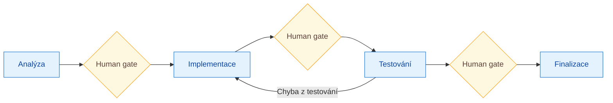
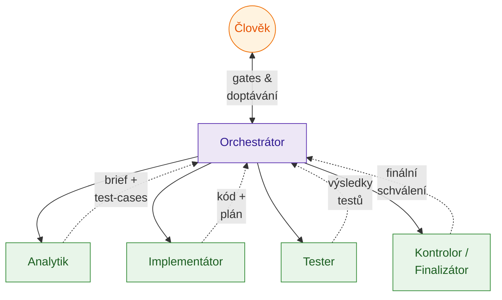
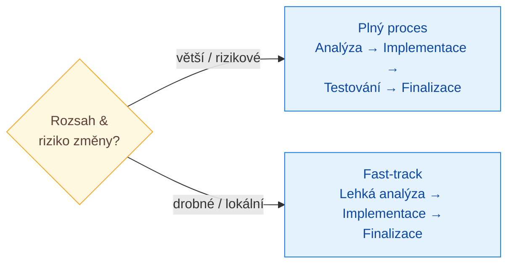

# AI-driven changes

High-level metodika pro řízení změn v softwaru s pomocí AI. Cílem není autonomní AI, která bez dozoru mění systém, ale **řízené workflow**, kde AI dělá specializovanou práci, orchestrátor hlídá tok a člověk rozhoduje v klíčových bodech.

Tento dokument je úmyslně stručný a technologicky nezávislý. Popisuje **principy a role**. Implementovat ho lze mnoha způsoby (AI agenti, LangGraph, vlastní orchestrátor, ručně podle checklistů, …).

---

## Hlavní myšlenka

Každá změna prochází čtyřmi fázemi. 

1. Analýza
2. Implementace
3. Testování
4. Finalizace

Po každé fázi následuje **kontrola člověkem**. V průběhu analýzy se navíc může člověk doptávat na nejasnosti.

Princip je nezávislý na technologii, jazyku ani typu aplikace. Mění se jen rozsah a hloubka, ne fáze samotné.

---

## Předpoklad úspěchu: kvalitní a technická dokumentace aktualizovana automaticky

Tato metodika stojí a padá s tím, jak rychle a levně dokáže AI (i člověk) získat přesný kontext o systému. Bez něj analytik tápe, implementátor hádá a kontrolor nemá s čím porovnávat. Doporučené minimum:

- **Technická wiki**  například ve stylu „LLM wiki" — strukturovaný popis kódu, architektury, přístupů, konceptů a entit, optimalizovaný pro čtení LLM i člověkem. Inspirace: [Karpathy — LLM wiki](https://gist.github.com/karpathy/442a6bf555914893e9891c11519de94f).
- **Log všech změn** — přístupná historie toho, co se v systému měnilo, proč a kdy (changelog, commit log s kontextem, archiv briefů a plánů). Umožňuje rychle dohledat, jak se k aktuálnímu stavu došlo, bez nutnosti znovu analyzovat celý kód.
- **Aktualizace ve finalizaci** — wiki i log se aktualizují **až ve finalizační fázi**, podle finálního stavu kódu. Implementační ↔ testovací smyčka může proběhnout vícekrát; regenerovat dokumentaci po každém průchodu by bylo drahé a stejně by hned zastarala. Finalizační krok se ale **nesmí přeskakovat** — zastaralá wiki je horší než žádná.

Čím přesnější a aktuálnější dokumentace, tím kratší analýza, méně doptávání člověka a méně chyb v implementaci.

---

## Role

V systému jsou čtyři pracovní role plus orchestrátor. Mohou to být AI agenti, lidé, nebo libovolná kombinace.

Orchestrátor je dispečer — drží stav, rozesílá práci, hlídá gates. Nikdy sám neschvaluje, to dělá výhradně člověk.

### Orchestrátor

Řídí celý tok. Drží stav změny, rozhoduje, kdo je na řadě, hlídá human gates, vrací práci zpět, když výstup neodpovídá zadání. Nikdy sám neschvaluje.

### Analytik

Pochopí problém ze všech dostupných zdrojů a převede ho na testovatelné zadání.

- prochází wiki, dokumentaci, zdrojový kód a další kontext aplikace,
- pokud je to potřeba, proklikává si aplikaci,
- ptá se člověka, když si není jistý (a to průběžně, ne jen na konci),
- velký nebo nejasný problém **rozdělí na menší části**,
- navrhuje testovací scénáře, podle kterých bude později testovat tester.

Výstup: analytický dokument (`brief.md`) a sada testovacích scénářů (`test-cases.md`).

### Implementátor

Z analyticky připraveného zadání udělá plán a provede implementaci.

- plán je vhodné nechat odsouhlasit (zvlášť u větších změn),
- samotnou implementaci může dělat AI agent i člověk; analytik a tester pak fungují jako podpora,

### Tester

Z testovacích scénářů připraví **automatizované testy** (např. Playwright, Cypress, jiný testovací framework) a spustí je.

- pokud test odhalí chybu v aplikaci, vrací úkol zpět implementátorovi,
- pokud automatizace selže (nelze rozumně napsat), explicitně to říká a předává zpět implementátorovi nebo na ruční ověření.
- v 

### Kontrolor / Finalizátor

Závěrečná fáze před uzavřením změny — zahrnuje **kontrolu i aktualizaci dokumentace**. Je to **jediné místo, kde se wiki a uživatelská dokumentace aktualizuje**.

- zkontroluje, jestli jsou všechny artefakty v souladu (brief, plán, kód, testy, dokumentace),
- ověří, že **původní záměr změny byl naplněn**,
- u změn bez automatických testů aplikaci proklikne ručně,
- **aktualizuje technickou wiki a uživatelskou dokumentaci** podle finálního stavu kódu — až teď, kdy implementace ↔ testování doiterovaly a kód je stabilní,
- doplní záznam do logu změn (co se měnilo a proč).

---

## Human gates

Člověk vstupuje do toku v těchto bodech:

1. **V průběhu analýzy** — analytik se doptává, když si není jistý.
2. **Po analýze** — schválení briefu a testovacích scénářů.
3. **Po plánu implementace** — schválení plánu (u větších změn).
4. **Po testování / finalizaci** — finální schválení změny.

Human gates se nepřeskakují. Mění se jen jejich hloubka podle velikosti změny.

---

## Fast-track pro drobné změny

Plný proces nesmí brzdit prkotiny. U **drobných a jednoduchých změn** (překlep, malá UI úprava, lokální oprava bez dopadu na business logiku) může orchestrátor zvolit fast-track:

- analytik **vypouští samostatné testovací scénáře**,
- tester nemusí psát žádné automatické testy (případně jen ručně proklikne),
- některé další kroky lze přeskočit a předat rovnou implementátorovi,
- kontrolor pak ověří, že záměr byl naplněn.

Human gates zůstávají, ale jsou kratší — typicky stačí jeden schvalovací krok na začátku a jeden na konci.

Rozhodnutí fast-track vs. plný proces dělá orchestrátor (nebo analytik) hned na začátku podle rozsahu a rizika změny.

---

## Co metodika záměrně neřeší

- konkrétní technologie (jazyk, framework, testovací nástroje, CI/CD),
- konkrétní rozhraní (Jira, GitHub, vlastní dashboard, …),
- konkrétní implementaci agentů (LangGraph, vlastní orchestrátor, …).

Toto všechno jsou implementační detaily. Metodika definuje **principy a role**, zbytek je na konkrétním nasazení.